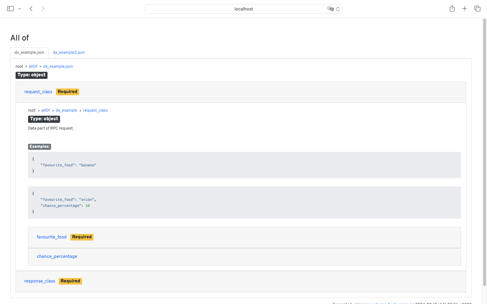
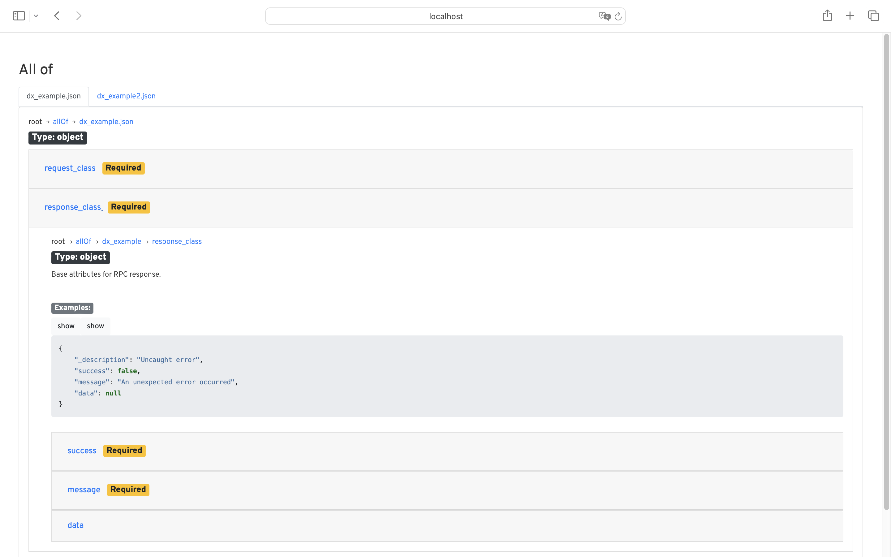

# python3-cyberfusion-rabbitmq-consumer-documentation-server

Documentation server for RPC exchange responses and requests.

Human-readable HTML documentation is served, as well as [JSON schemas](https://json-schema.org/).

## HTML documentation

URL: `/html`

*Request*

*Response*

## JSON schemas

URL: `/schemas`

The root returns a list of schemas. Every schema can be accessed as a subpath. For example: `/schemas/dx_example.json`

The list always includes a schema called `head.json`. This schema includes all schemas.

# Install

## Generic

Run the following command to create a source distribution:

    python3 setup.py sdist

## Debian

Run the following commands to build a Debian package:

    mk-build-deps -i -t 'apt -o Debug::pkgProblemResolver=yes --no-install-recommends -y'
    dpkg-buildpackage -us -uc

# Configure

No configuration is supported.

# Usage

## Start

### Manually

    /usr/bin/rabbitmq-consumer-documentation-server --host=:: --port=9012

### systemd

    systemctl start rabbitmq-consumer-documentation-server.service

#### Environment variables

* `HOST` (`--host`). Default: `::`
* `PORT` (`--port`). Default: `9012`

# Tests

Run tests with pytest:

    pytest tests/
